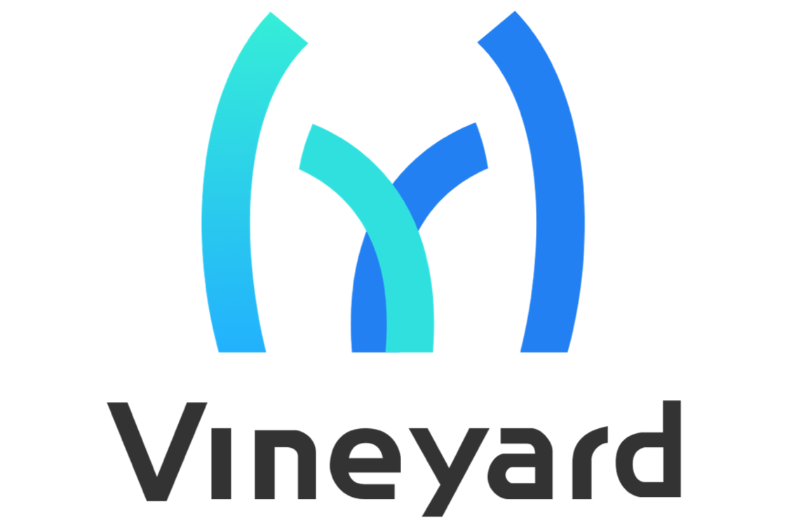

.. vineyard documentation master file, created by
   sphinx-quickstart on Tue Aug 27 10:19:05 2019.
   You can adapt this file completely to your liking, but it should at least
   contain the root `toctree` directive.

.. meta::
   :description: Vineyard (v6d), a CNCF sandbox project, is an in-memory immutable data manager
      that provides **out-of-the-box high-level** abstraction and **zero-copy in-memory** sharing for
      distributed data in big data tasks, such as graph analytics (e.g., `GraphScope`_), numerical
      computing (e.g., `Mars`_), and machine learning.
   :keywords: distributed-systems, distributed, shared-memory, graph-analytics, in-memory-storage, big-data-analytics, distributed-comp

   **an in-memory immutable data manager**

|Vineyard CI| |FAQ| |Discussion| |Slack| |License|

Why bother?
-----------

Sharing intermediate data between systems in modern big-data & AI workflows is often challenging
and is often a significant bottleneck in such jobs. Considering the following fraud-detection
pipeline,

.. figure:: images/fraud-detection-job.jpg
   :width: 397
   :alt: A real-life fraud detection job

   A real-life fraud detection job

From the pipeline we observed

1. Users usually force to program with dedicated computing systems for different tasks in the
   same applications For the same task, e.g., SQL and Python.

   Introducing a new computing system into production environments requires high technical
   effort to align with existing production environments I/O, failover,

2. Data could be polymorphic. Non-relational data, such as tensors, dataframes (in Pandas) and
   graphs/networks (in `GraphScope`_) are becoming increasingly prevalent. Tables and SQL may
   not be best way to store/exchange or process them.

   Having the data transformed from/to "tables" back and forth between different systems could
   be a huge overhead.

3. Saving/loading the data to/from the external storage requires lots of memory-copies and IO costs.

3. Saving/loading the data to/from the external storage
   requires lots of memory-copies and IO costs.

What is vineyard?
-----------------

Vineyard (v6d) is an in-memory immutable data manager that provides **out-of-the-box high-level**
abstraction and **zero-copy in-memory** sharing for distributed data in big data tasks, such as
graph analytics (e.g., `GraphScope`_), numerical computing (e.g., `Mars`_), and machine learning.

Features
^^^^^^^^

Efficient data sharing
~~~~~~~~~~~~~~~~~~~~~~

Vineyard shares immutable data across different systems via shared memory without extra overheads,
eliminating the overhead of serialization/deserialization and IO during exchanging immutable
data between systems.

Out-of-the-box data abstraction
~~~~~~~~~~~~~~~~~~~~~~~~~~~~~~~

Vineyard defines a metadata-payload separated data model to capture the payload-commonalities and
method-commonalities between sharable objects in different programming languages and different
computing systems in an unified way.

The interface description language **VCDL** is designed to annotate sharable members and methods
and boilerplate code will be automatically generated for minimalist integration effort.

Pluggable I/O routines
~~~~~~~~~~~~~~~~~~~~~~

Many big data analytical tasks have lots of boilerplate routines for tasks that unrelated to the
computation itself, e.g., various IO adaptors, data partition strategies and migration jobs. As
the data structure abstraction usually differs between systems such routines cannot be easily reused.

Vineyard provides such common manipulate routines on immutable data as drivers, which extends
the capability of data structures by registering properly drivers, enabling out-of-the-box reusing
for the boilerplate part between diverse computation jobs.

Data orchestration on Kubernetes
~~~~~~~~~~~~~~~~~~~~~~~~~~~~~~~~

Vineyard provides efficient distributed data sharing in cloud-native environment by embracing
cloud-native big data processing and Kubernetes helps vineyard leverage the scale-in/out and
scheduling ability of Kubernetes.

Use cases
^^^^^^^^^

.. panels::
   :header: text-center
   :container: container-lg pb-4
   :column: col-lg-4 col-md-4 col-sm-4 col-xs-12 p-2
   :body: text-center

   .. link-button:: #
      :type: url
      :text: Object Manager
      :classes: btn-block stretched-link

   Putting and getting arbitrary objects using vineyard, in zero-copy way!

   ---

   .. link-button:: #
      :type: url
      :text: Cross-system Sharing
      :classes: btn-block stretched-link

   Sharing large objects across computing systems.

   ---

   .. link-button:: #
      :type: url
      :text: Data orchestration
      :classes: btn-block stretched-link

   Vineyard coordinates the flow of objects and jobs on Kubernetes based on data-aware scheduling.

Get started now!
----------------

.. panels::
   :header: text-center
   :column: col-lg-12 p-2

   .. link-button:: notes/getting-started
      :type: ref
      :text: User Guides
      :classes: btn-block stretched-link
   ^^^^^^^^^^^^
   Getting started with vineyard.

   ---

   .. link-button:: notes/cloud-native/deploy-kubernetes
      :type: ref
      :text: Deploy on Kubernetes
      :classes: btn-block stretched-link
   ^^^^^^^^^^^^
   Deploying vineyard on Kubernetes and accelerate big-data analytical workflows on cloud-native
   infrastructures.

   ---

   .. link-button:: tutorials/tutorials
      :type: ref
      :text: Tutorials
      :classes: btn-block stretched-link
   ^^^^^^^^^^^^
   Use cases and tutorials where vineyard can bring added-value.

   ---

   .. link-button:: notes/developers
      :type: ref
      :text: Getting Involved
      :classes: btn-block stretched-link
   ^^^^^^^^^^^^
   Get involved and become part of the vineyard community.

   ---

   .. link-button:: notes/developers/faq
      :type: ref
      :text: FAQ
      :classes: btn-block stretched-link
   ^^^^^^^^^^^^
   Frequently asked questions and discussion during adopting vineyard.

Vineyard is a `CNCF sandbox project`_ and indeed made successful by its community.

.. image:: https://v6d.io/_static/cncf-color.svg
   :width: 400
   :alt: Vineyard is a CNCF sandbox project

.. toctree::
   :maxdepth: 1
   :caption: User Guides
   :hidden:

   notes/getting-started.rst
   notes/key-concepts.rst
   notes/user-guides.rst

.. toctree::
   :maxdepth: 1
   :caption: Cloud-Native
   :hidden:

   notes/cloud-native/deploy-kubernetes.rst
   notes/cloud-native/vineyard-operator.rst
   Command-line tool <notes/cloud-native/vineyardctl.md>

.. toctree::
   :maxdepth: 1
   :caption: Tutorials
   :hidden:

   tutorials/data-processing.rst
   tutorials/kubernetes.rst
   tutorials/extending.rst

.. toctree::
   :maxdepth: 1
   :caption: Integration
   :hidden:

   notes/integration-bigdata.rst
   notes/integration-orchestration.rst

.. toctree::
   :maxdepth: 2
   :caption: API Reference
   :hidden:

   notes/references.rst

.. toctree::
   :maxdepth: 1
   :caption: Developer Guides
   :hidden:

   notes/developers.rst
   notes/developers/faq.rst

.. _Mars: https://github.com/mars-project/mars
.. _GraphScope: https://github.com/alibaba/GraphScope
.. _CNCF sandbox project: https://www.cncf.io/sandbox-projects/

.. |Vineyard CI| image:: https://github.com/v6d-io/v6d/workflows/Vineyard%20CI/badge.svg
   :target: https://github.com/v6d-io/v6d/actions?workflow=Vineyard%20CI
.. |FAQ| image:: https://img.shields.io/badge/-FAQ-blue?logo=Read%20The%20Docs
   :target: https://v6d.io/notes/faq.html
.. |Discussion| image:: https://img.shields.io/badge/Discuss-Ask%20Questions-blue?logo=GitHub
   :target: https://github.com/v6d-io/v6d/discussions
.. |Slack| image:: https://img.shields.io/badge/Slack-Join%20%23vineyard-purple?logo=Slack
   :target: https://slack.cncf.io/
.. |License| image:: https://img.shields.io/github/license/v6d-io/v6d
   :target: https://github.com/v6d-io/v6d/blob/main/LICENSE
