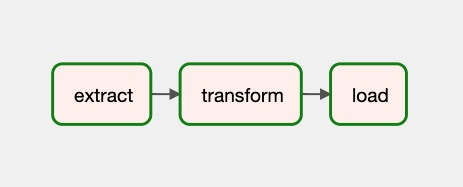

Airflow on Vineyard
===================

Big data analytical pipelines usually involves various kinds of workloads, each
of them requires a dedicated compute system to finish the job, and intermediate
data flows between tasks in the pipeline. The extra cost of transferring data
takes a non-negligible portion in the end-to-end performance in real world deployment
and the optimization is challenging.

Integrating Vineyard with Airflow brings opportunities to mitigate the problem.

Introducing Airflow
-------------------

Airflow is a platform that allows users programmatically author, schedule and
monitor workflows. Users organize tasks a DAG and the Airflow scheduler executes
the tasks on workflows while following the specified dependencies.

Taking the following ETL workflow as an example [1]_,

.. code:: python

    @dag(schedule_interval=None, start_date=days_ago(2), tags=['example'])
    def tutorial_taskflow_api_etl():
        @task()
        def extract():
            data_string = '{"1001": 301.27, "1002": 433.21, "1003": 502.22}'

            order_data_dict = json.loads(data_string)
            return order_data_dict

        @task(multiple_outputs=True)
        def transform(order_data_dict: dict):
            return {"total_order_value": total_order_value}

        @task()
        def load(total_order_value: float):
            print(f"Total order value is: {total_order_value:.2f}")

        order_data = extract()
        order_summary = transform(order_data)
        load(order_summary["total_order_value"])

    tutorial_etl_dag = tutorial_taskflow_api_etl()

It forms the following DAG, including three individual tasks as the nodes, and
edges between nodes that describe the data dependency relations. Airflow scheduler
runs the tasks one after another based the the data dependency.

Airflow on Vineyard
-------------------

Why Airflow on Vineyard
^^^^^^^^^^^^^^^^^^^^^^^

Airflows works pretty well on defining and orchestrating the complex workflows.
However, the data flow in the pipeline is still a missing piece. Airflow leverages
the database backend, e.g., SQLite, MySQL and PostgreSQL to store the intermediate
data between tasks. Large-scale data in real world scenarios cannot be fit into
the database, e.g., large tensors, dataframes, and even distributed graphs, and
external storage like HDFS, S3 will be used to store the intermediate data, and
there's only an identifer in the database.

Using external storage system to share the intermediate data among tasks in big
data analytical pipelines suffers the performance cost of data copy, serialization/
serialization and network data transfer.

Vineyard is designed for sharing intermediate data in-memory efficiently for big
data analytical pipeline and it is a natural fit for workloads on Airflow.

How Vineyard Works for Airflow
^^^^^^^^^^^^^^^^^^^^^^^^^^^^^^

Airflow allows users to registering an external **XCom** backend and that's exactly
vineyard is designed for.

Vineyard works as a *XCom* backend for airflow workers to allow transferring
large-scale data objects between tasks that cannot be fit into the Airflow's
database backend without involving external storage systems like HDFS. The
Vineyard XCom backend handles object migration as well when the required inputs
is not located on where the task is scheduled to execute.

Vineyard's XCom backend archives its functionalities by injecting hooks to the
process of saving values to backend and fetching values from backend, as described
follows:

.. code:: python

    class VineyardXCom(BaseXCom):

        @staticmethod
        def serialize_value(value: Any):
            """ Store the value to vineyard server, and serialized the result
                Object ID to save it into the backend database later.
            """

        @staticmethod
        def deserialize_value(result: "XCom") -> Any:
            """ Obtain the Object ID after deserialization, and fetching the
                underlying value from vineyard.

                This value is resolved from vineyard objects in a zero-copy
                fashion.
            """

When it Comes to Distributed Deployment
^^^^^^^^^^^^^^^^^^^^^^^^^^^^^^^^^^^^^^^

Airflow supports executing tasks on a set of workers to parallelize the
processing of complex workflows. In a distributed deployment (with the
:code:`CeleryExecutor`), two tasks that shares intermediate data might
be scheduled to different workers, and a remote data accessing is needed.

Vineyards supports migration for arbitrary objects. In the XCom backend,
when the IPC client meets remote objects, it first trigger a migration
action to move the objects to local to make sure the input data is ready
before executing the tasks.

The migration of objects is transparent to users and relieves the burden
of thinking about of complex data operations and movement then the data
scientists can focus on the computation logic when developing a big data
applications on Airflow.

Running Vineyard + Airflow
--------------------------

Users can try Airflow provider for Vineyard by the following steps:

1. Install required packages:

    .. code:: bash

        pip3 install airflow-provider-vineyard

2. Configure Vineyard locally

    The vineyard server can be easier launched locally with the following command:

    .. code:: bash

        python -m vineyard --socket=/tmp/vineyard.sock

    See also our documentation about `launching vineyard`_.

3. Configure Airflow to use the vineyard XCom backend by specifying the environment
    variable

    .. code:: bash

        export AIRFLOW__CORE__XCOM_BACKEND=vineyard.contrib.airflow.xcom.VineyardXCom

    and configure the location of UNIX-domain IPC socket for vineyard client by

    .. code:: bash

        export AIRFLOW__VINEYARD__IPC_SOCKET=/tmp/vineyard.sock

    or

    .. code:: bash

        export VINEYARD_IPC_SOCKET=/tmp/vineyard.sock

4. Launching your airflow scheduler and workers, and run the following DAG as example,

    .. code:: python

        import numpy as np
        import pandas as pd

        from airflow.decorators import dag, task
        from airflow.utils.dates import days_ago

        default_args = {
            'owner': 'airflow',
        }

        @dag(default_args=default_args, schedule_interval=None, start_date=days_ago(2), tags=['example'])
        def taskflow_etl_pandas():
            @task()
            def extract():
                order_data_dict = pd.DataFrame({
                    'a': np.random.rand(100000),
                    'b': np.random.rand(100000),
                })
                return order_data_dict

            @task(multiple_outputs=True)
            def transform(order_data_dict: dict):
                return {"total_order_value": order_data_dict["a"].sum()}

            @task()
            def load(total_order_value: float):
                print(f"Total order value is: {total_order_value:.2f}")

            order_data = extract()
            order_summary = transform(order_data)
            load(order_summary["total_order_value"])

        taskflow_etl_pandas_dag = taskflow_etl_pandas()

In above example, task :code:`extract` and task :code:`transform` shares a
:code:`pandas.DataFrame` as the intermediate data, which is impossible as
it cannot be pickled and when the data is large, it cannot be fit into the
table in backend databases of Airflow.

The example is adapted from the documentation of Airflow, see also
`Tutorial on the Taskflow API`_.

Further Ahead
-------------

The Airflow provider for Vineyard is still in every experimental stage and shows
a lot of gains for efficiently and flexibly sharing large-scale intermediate data
using Vineyard for big data analytical workflows in Airflow.

The Airflow community is also striving on better support for modern big data & AI
applications and we believe integrating Vineyard, Airflow, and other cloud-native
infrastructures could deliver a better and more efficient solution for data scientists.

.. [1] See: https://airflow.apache.org/docs/apache-airflow/stable/tutorial_taskflow_api.html

.. _launching vineyard: https://v6d.io/notes/getting-started.html#starting-vineyard-server
.. _Tutorial on the Taskflow API: https://airflow.apache.org/docs/apache-airflow/stable/tutorial_taskflow_api.html
