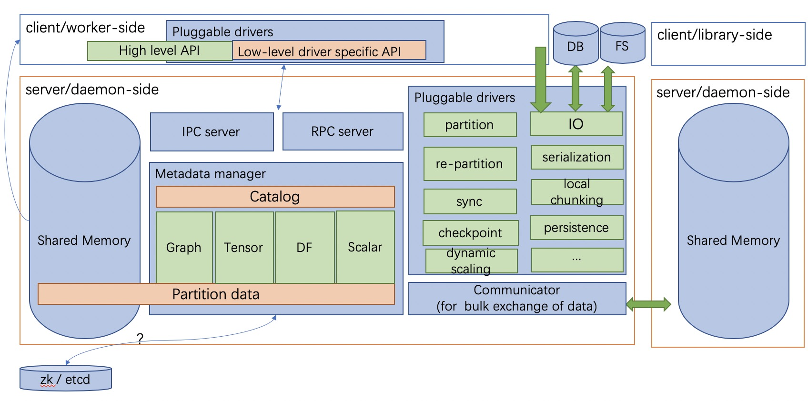

Diving into vineyard
====================

Motivation
----------

Existing big data practice usually adopts distributed databases or file systems as the 
intermedia storage to share **immutable** distributed data between heterogeneous 
computation systems that are involved in a big data task. This
brings two significant overheads:

1. the structual data are transformed from/to the
   external data storage format (e.g., tables in relational databases, files in HDFS) 
   back and forth in the beginning/end of each computation step, meanwhile, the 
   structure and operations of the data are dismissed.

2. saving/loading the data to/from the external storage
   requires lots of memory-copies and disk-IO costs, which becomes
   the bottleneck of the entire process in more and more cases as the efficiency
   of the computation systems are growing rapidly these years. 
   
In addition, the lack of managing the data uniformly through the big data task obstructs
the application of modern techniques such as data monitoring, data-aware
optimization, and fault-tolerance, thus, further decreases the productive efficiency.

Overview
--------

To address this issue, vineyard provides:

1.  **in-memory** distributed data sharing in a **zero-copy** fashion to avoid 
    introducing extra I/O costs by exploiting a shared memory manager derived from plasma.

    In general, vineyard servers are 
    launched as daemons in every machine of the underlying cluster to make up 
    a vineyard cluster, 
    and each vineyard instance will allocate a shared memory pool to store 
    the corresponding partition of the distributed data, 
    and the meta data of the distributed data will be shared across
    the vineyard cluster via the backend key-value store, e.g., etcd or zookeeper. 

    .. image:: ../images/vineyard_deployment.jpg
       :alt: Vineyard deployment

    For example, a distributed tensor is stored in the vineyard cluster as illustrated above.
    Each partition is stored in the corresponding vineyard instance, 
    while the meta data, e.g., the shape of the tensor is stored in the backend 
    key-value server of vineyard, i.e., the etcd server.

    To reuse the distributed tensor in parallel processing, each process will first
    establish a vineyard client connecting to the corresponding vineyard instance on the 
    same machine, and then get the meta data of the distributed tensor. Finally based on
    the meta data, each process can get the corresponding partition of the distributed tensor
    from the vineyard instance via memory mapping in a **zero-copy** fashion,
    and start to use the data for computation.
    

2.  built-in **out-of-box high-level** abstraction to share the distributed 
    data with complex structures (e.g., distributed graphs) 
    with nearly zero extra development cost, while the transformation costs are eliminated.

    For example, a distributed graph is composed of fragments that are stored distributedly 
    over the vineyard cluster, and each fragment consists of vertices, edges, data on vertices,
    data on edges, indices (e.g., the CSR indexing), vertex maps and so on. Unlike the external 
    storage approach where fragments are transformed into adjacent matrix to fit into a table
    schema in the database, vineyard stores the fragment with the structure, so that when we use the 
    graph, the indices can be directly reused to facilitate the graph traversal. Furthermore,
    the high-level abstracted graph traversal operations are built-in with the vineyard distributed
    graph, as a result, nearly zero extra development are required to reuse the data.

Architecture
------------

The figure demonstrates the architecture of vineyard. 

On the server/daemon side (i.e., the aforementioned vineyard instance), there are four major components:

1.  the shared memory is the memory space in vineyard that shares with vineyard clients via
    the UNIX domain socket by memory mapping. As we mentioned before, the partitions of the
    distributed data are living in the shared memory of the corresponding vineyard instance in 
    the cluster.

2.  the metadata manager provides management for the metadata of the data stored in vineyard. 
    It keeps the strutures, layouts and properties of the data to provide high-level abstractions 
    (e.g., graphs, tensors, dataframes). The metadata
    managers in a vineyard cluster communicate with each other through the backend key-value store, 
    e.g., etcd server, to keep the consistency of the distributed data stored in vineyard.

3.  the pluggable drivers assign specific functionalities to certain types of data in vineyard.
    In particular, I/O drivers sync with external storages such as databases and file systems to
    read data into and write data from vineyard, while partition and re-partition drivers 
    reorganize the distributed graphs stored in vineyard to balance the workload. Note that the 
    drivers usually employes the low-level API for delicate operations.

4.  the ipc/rpc servers handle the ipc/rpc connections respectively from vineyard clients 
    and the communicator supports
    bulk exchange of data between vineyard instances. In particular, the client can get the metadata
    of the data stored in vineyard through both ipc and rpc connections. But to get the data partition,
    the client has to connect to the vineyard instance through UNIX domain socket, this is because, 
    the data sharing is via the system call of memory mapping, thus requires the client 
    to stay in the same machine of the vineyard instance.
    

On the other hand, the client side consists of both the high-level APIs (e.g., edge traversals for 
distributed graphs) to easily reuse the
data in vineyard and the low-level APIs for specific drivers to access the vineyard instance
in a more delicate fashion.

Vineyard Object Design
----------------------

Vineyard represents all kinds of data as vineyard objects, 
for any vineyard object, it consists of two parts: 

1.  a set of blobs where the payload of the data lives in;

2.  a hierarchical meta tree which describes the type,
    layout and properties of the data. 
    
The decoupling design of data payload and data layout brings three benefits:

1. The payload is stored locally in each vineyard instance, while the meta data is shared
   among all the vineyard instances across the cluster. This significantly reduces the costs 
   to keep the distributed data consistent.

2. It makes vineyard objects self-interpreted, since the meta data fully determines how
   the object should be resolved. This not only brings the consistency in semantics when
   sharing vineyard objects between different systems and different programming languages,
   but also allows users to store complex data structures in high-level abstraction, such
   as graphs in CSR model directly in vineyard, without serializing/deserializing
   the object every time saving/loading it from vineyard.

3. It facilitates the exploiting of data-aware scheduling techniques, e.g., when we process
   a graph in vineyard, we can easily access the meta tree of the graph to see how large each
   partitioned fragment is without touching the real vertices and edges of the graph, as such,
   we can assign precise amount of computation resources for each fragment to achieve overall
   performance enhancement.

In particular, for the meta data and methods of vineyard objects, vineyard employs two design choices:

1.  the composable design on vineyard objects to
    facilitate distributed data management;

2.  the extensible design on methods of
    vineyard objects to enable flexible data sharing between different computation systems
    with nearly zero extra development cost.

Composable Design
^^^^^^^^^^^^^^^^^

The composition mechanism applies as the hierarchical tree structure
of the meta data of vineyard objects. The root meta data of a complex object
stores the links to the root meta data of its components, and by traversing the 
links recursively, a complete meta tree is produced for the complex object. 

For example, a distributed graph is composed of partitioned graph fragments, while
a graph fragment is composed of vertices and edges within that fragment. Recall the
decoupling design of payload and layout of vineyard objects, in a graph fragment, 
the vertices and edges within the fragment is stored locally in the corresponding
vineyard instance for the partition, meanwhile, the meta data (e.g., partition index,
number of vertices, and number of edges) are stored in the backend key-value store. 

To save a distributed graph, we first save the partitioned fragments in each vineyard instance,
and share their meta data in the backend key-value store, and then we can create the distributed
graph by creating the root meta data that contains the links to the root meta data of the fragments
in an efficient fashion.

Extensible Design
^^^^^^^^^^^^^^^^^

Vineyard employs the extensible design concept of registry mechanism
to facilitate users transplanting their data structures into vineyard.

In particular, our extensible design on builders, resolvers and drivers,
allows users to build, resolve and share their data structures easily
through different systems and paradigms respectively, and the registry
mechanism is so basic that even the core data structures and drivers in
vineyard also follows the same design.

So what is the registry mechanism? 

In general, the registry mechanism
decouples the methods from the definition of vineyard data types. For
builders and resolvers, it means users can flexiblely register different
implementation in different languages to build and resolve the same
vineyard data type, which makes the data available to share between
different systems and paradigms, and makes it possible to exploit native
language optimizations. 

On the other hand, for drivers, the registry
mechanism allows users to flexiblely plug-in functionality methods in
different languages for vineyard data types, which assigns required
capability to the data types along with the data analyical process.

Further more, the registered methods can be implemented and optimized
in accordance with specific data analytical tasks for further efficiency
augmentation.

Implementation Details
----------------------

Vineyard object
^^^^^^^^^^^^^^^

As we mentioned before, for each object in vineyard, it consists of two
parts:

1. The data payload stored in the corresponding vineyard instance locally
2. The hierarchical meta data shared across the vineyard cluster

In particualr, ``Blob`` is the unit where the data payload lives in a vineyard
instance.
A blob object holds a segment of memory in the bulk store of the vineyard
instance, so that users can save their local buffer into a blob and
get the blob later in another process in a zero-copy fashion through
memory mapping.

.. code:: Python

    >>> payload = "Hello, World!"
    >>> blob_id = client.put(payload)
    >>> blob = client.get(blob_id)
    >>> print(blob.typename, blob.length, blob)

.. code:: console

    > vineyard::Blob 13 Hello, World!

On the other hand, the hierarchical meta data of vineyard objects are
shared across the cluster. In the following example, for simplicity, 
we launch a vineyard cluster with
two vineyard instances in the same machine, although in practice, 
these vineyard instances are launched distributedly on each machine of the cluster.

.. code:: console

    $ vineyardd --socket /var/run/vineyard.sock1
    $ vineyardd --socket /var/run/vineyard.sock2

Then we can create a distributed pair of arrays in vineyard with the
first array stored in the first vineyard instance which listens to ipc_socket
``/var/run/vineyard.sock1``, and the second array stored in the second instance
listening to ipc_socket ``/var/run/vineyard.sock2``.

.. code:: Python

    >>> import numpy as np
    >>> import vineyard
    >>> import vineyard.array
     
    >>> # build the first array in the first vineyard instance
    >>> client1 = vineyard.connect('/var/run/vineyard.sock1')
    >>> id1 = client1.put(np.zeros(8))
     
    >>> # build the second array in the second vineyard instance
    >>> client2 = vineyard.connect('/var/run/vineyard.sock2')
    >>> id2 = client2.put(np.ones(4))
     
    >>> # build the pair from client1
    >>> obj1 = client1.get_object(id1)
    >>> obj2 = client2.get_object(id2)
    >>> id_pair = client1.put((obj1, obj2))
     
    >>> # get the pair object from client2
    >>> obj_pair = client2.get_object(id_pair)
    >>> print(obj_pair.first.typename, obj_pair.first.size(), obj_pair.second.size())
     
    >>> # get the pair value from client2
    >>> value_pair = client2.get(id_pair)
    >>> print(value_pair)

.. code:: console

    > vineyard::Array 8 4
    > (None, [1, 1, 1, 1])

Here we can get the meta data of the pair object from ``client2``
though ``client1`` created it, but we can't get the payload of the
first element of the pair from ``client2``, since it is stored locally
in the first vineyard instance.

Builder and resolver
^^^^^^^^^^^^^^^^^^^^

As we shown above, vineyard allows users to register builders/resolvers to build/resolve
vineyard objects from/to the data types in the client side based on the computation requirements.

Suppose ``pyarrow`` types are employed in the context, then we can define the builder and
resolver between ``vineyard::NumericArray`` and ``pyarrow.NumericArray`` as follows:

.. code:: Python

    >>> def numeric_array_builder(client, array, builder):
    >>>     meta = ObjectMeta()
    >>>     meta['typename'] = 'vineyard::NumericArray<%s>' % array.type
    >>>     meta['length_'] = len(array)
    >>>     meta['null_count_'] = array.null_count
    >>>     meta['offset_'] = array.offset
    >>> 
    >>>     null_bitmap = buffer_builder(client, array.buffers()[0], builder)
    >>>     buffer = buffer_builder(client, array.buffers()[1], builder)
    >>> 
    >>>     meta.add_member('buffer_', buffer)
    >>>     meta.add_member('null_bitmap_', null_bitmap)
    >>>     meta['nbytes'] = array.nbytes
    >>>     return client.create_metadata(meta)
     
    >>> def numeric_array_resolver(obj):
    >>>     meta = obj.meta
    >>>     typename = obj.typename
    >>>     value_type = normalize_dtype(re.match(r'vineyard::NumericArray<([^>]+)>', typename).groups()[0])
    >>>     dtype = pa.from_numpy_dtype(value_type)
    >>>     buffer = as_arrow_buffer(obj.member('buffer_'))
    >>>     null_bitmap = as_arrow_buffer(obj.member('null_bitmap_'))
    >>>     length = int(meta['length_'])
    >>>     null_count = int(meta['null_count_'])
    >>>     offset = int(meta['offset_'])
    >>>     return pa.lib.Array.from_buffers(dtype, length, [null_bitmap, buffer], null_count, offset)

Finally, we register the builder and resolver for automatic building and resolving:

.. code:: Python

    >>> builder_ctx.register(pa.NumericArray, numeric_array_builder)
    >>> resolver_ctx.register('vineyard::NumericArray', numeric_array_resolver)

.. _divein-driver-label:

Driver
^^^^^^

As we shown in the getting-started, the ``open`` function in vineyard can open a local file as a stream 
for consuming, and we notice that the path of the local file is headed with the 
scheme ``file://``. 

Actually, vineyard supports several different types of data 
source, e.g., ``kafka://`` for kafka topics. The functional methods to open different data sources as 
vineyard streams are called ``drivers`` in vineyard. They are registered to 
``open`` for specific schemes, so that when ``open`` is invoked, it will dispatch the 
corresponding driver to handle the specific data source according to the scheme of 
the path. 

The following sample code demonstrates the dispatching logic in ``open``, and the 
registration examples.

.. code:: Python

    >>> @registerize
    >>> def open(path, *args, **kwargs):
    >>>     scheme = urlparse(path).scheme
        
    >>>     for reader in open.__factory[scheme][::-1]:
    >>>         r = reader(path, *args, **kwargs)
    >>>         if r is not None:
    >>>             return r
    >>>     raise RuntimeError('Unable to find a proper IO driver for %s' % path)

    >>> # different driver functions are registered as follows
    >>> open.register('file', local_driver)
    >>> open.register('kafka', kafka_driver)

Most importantly, the registration design allows users to register their own 
drivers to ``registerized`` vineyard methods using ``.register``, which prevents
major revisions on the processing code to fullfill customized computation requirements.

Features and Limitations
-----------------------------

Targeted design for distributed data sharing in big data tasks
^^^^^^^^^^^^^^^^^^^^^^^^^^^^^^^^^^^^^^^^^^^^^^^^^^^^^^^^^^^^^^

By examing the practice of big data tasks such as numeric computing, machine learning
and graph analysis carefully,
we summerize that the data involved has four properites:

+ distributed and each partioned fragment usually fits into memory;
+ immutable, i.e., never modified after creation;
+ with complex structure, e.g., graph in CSR format;
+ required to share between different computation systems and programming languages.
    
Thus vineyard is designed accordingly with:

+ composable design on vineyard objects;
+ immutable zero-cost in-memory data sharing via memory mapping;
+ out-of-box high-level data abstraction for complex data structures;
+ extensible design on builder/resolver/driver for flexible crossing-system and
  crossing-language data sharing.
      
In general, the design choices of vineyard are fully determined on coping
the difficulties in handling large-scale distributed data in practice.

Out-of-box high-level data abstraction
^^^^^^^^^^^^^^^^^^^^^^^^^^^^^^^^^^^^^^

Vineyard objects are stored with structures, and high-level abstractions.
For instance, a graph with CSR format in vineyard stores the index as long as
the vertices and edges, so that operations like edge iteration based on the 
index can be provided. Thus, users don't have to implement the index-building 
function and edge iterators by themselves, which is usually required in the 
existing big data practice.

Zero-cost in-memory data sharing
^^^^^^^^^^^^^^^^^^^^^^^^^^^^^^^^

Vineyard provides zero-cost data sharing by memory-mapping, since data objects
in vineyard are immutable. When the object is created, we allocate blobs in
vineyard to store the data payload, on the other hand, when getting the object,
we map the blob from the vineyard instance into the application process with
inter-process memory mapping approaches, so that no memory copy is involved
in sharing the data payload.

Convinient data integration
^^^^^^^^^^^^^^^^^^^^^^^^^^^

The extensive design on builder/resolver/driver allows convinient extention
of existing vineyard objects to different programming languages. Moreover,
with codegen tools in vineyard, makes it possible for users to transplant their data
structures into vineyard with only a few annotations.

Data orchestration in a python notebook
^^^^^^^^^^^^^^^^^^^^^^^^^^^^^^^^^^^^^^^^^^^^^^^^^^^^^^^^^^^^^^^^^^

Using vineyard as the common data orchestration engine through the end-to-end
big data processing, users can hold lareg-scale distributed data as variables
of vineyard objects in python. Thus, as long as the computation modules
involved provides python API, users can write down the entire processing
pipeline in a python notebook. By running the python script, users can
manage trillions of data and different computation systems in the backgound
distributedly across the cluster.

NOT for mutable objects
^^^^^^^^^^^^^^^^^^^^^^^

Once a vineyard object is created and sealed in the vineyard instance, it
becomes immutable and can NOT be modified anymore. Thus vineyard is not
suitable to be utilized as a data cache to store mutable data that changes
rapidly along the processing pipeline.

NOT for instant remote data partition accessing
^^^^^^^^^^^^^^^^^^^^^^^^^^^^^^^^^^^^^^^^^^^^^^^^^

The partitions of a distributed data are stored distributedly in corresponding
vineyard instances of the cluster. Only the client on the same machine can access
the data partition. In case to access a remote partition, data migration APIs of vineyard
can be invoked to trigger migration process, but not for instant accessment.
