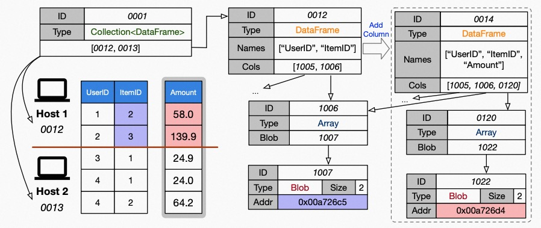

.. _vineyard-objects:

Objects
=======

Vineyard represents all kinds of data as vineyard objects. Vineyard adopts a
metadata-payloads decoupled design and an object in vineyard consists of two folds:

1.  A set of blobs where the payload of the data lives in;
2.  A hierarchical meta tree which describes the type, layout and properties of the data.

.. _metadata-and-payloads:

Object = metadata + payloads
----------------------------

There are some examples that explain the basic idea of metadata and payload that
forms vineyard objects:

- Blob: A blob is a pointer with a length that describes the size of the data,

  - metadata:

    - :code:`length`

  - payloads:

    - :code:`pointer`, the actual payload of the blob

- Tensor: A tensor can be viewed as a blob that contains the actual data and several
  metadata entries that describe the shape and type information,

  - metadata:

    - :code:`shape`
    - :code:`dtype`
    - :code:`data`, a member with type :code:`Blob`

  - payloads:

    - :code:`pointer` in the member :code:`data`

- Dataframe: A dataframe is an ordered collection of tensors as its columns and each
  column has a unique name,

  - metadata:

    - :code:`column_size`
    - :code:`names`, a list of members with type :code:`string`
    - :code:`columns`, a list of member with type :code:`Tensor`

  - payloads:

    - a set of :code:`pointer` in the member :code:`columns` (the member :code:`data` of
      of those :code:`Tensor` s)

From the example above you could see that the objects naturally fit a hierarchical
model and complex data objects can be composed from some simpler objects. Each object
contains a set of blobs as the payload, and a metadata (in tree form) that describes
the semantic and organizations of those blobs.

.. admonition:: An example for the object metadata: a dataframe with two columns where each
                column is a tensor.
   :class: admonition-details

   .. code:: json

        {
            "__values_-key-0": "1",
            "__values_-key-1": "\"a\"",
            "__values_-size": 2,
            "__values_-value-0": {
                "buffer_": {
                    "id": "o800527ecdf05cff9",
                    "instance_id": 39,
                    "length": 0,
                    "nbytes": 0,
                    "transient": true,
                    "typename": "vineyard::Blob"
                },
                "id": "o000527ecdffd95c4",
                "instance_id": 39,
                "nbytes": 400,
                "partition_index_": "[]",
                "shape_": "[100]",
                "signature": 1451273207424436,
                "transient": false,
                "typename": "vineyard::Tensor<float>",
                "value_type_": "float"
            },
            "__values_-value-1": {
                "buffer_": {
                    "id": "o800527ecdeaf1015",
                    "instance_id": 39,
                    "length": 0,
                    "nbytes": 0,
                    "transient": true,
                    "typename": "vineyard::Blob"
                },
                "id": "o000527ece12e4f0a",
                "instance_id": 39,
                "nbytes": 800,
                "partition_index_": "[]",
                "shape_": "[100]",
                "signature": 1451273227452968,
                "transient": false,
                "typename": "vineyard::Tensor<double>",
                "value_type_": "double"
            },
            "columns_": "[\"a\",1]",
            "id": "o000527ece15d374c",
            "instance_id": 39,
            "nbytes": 1200,
            "partition_index_column_": 0,
            "partition_index_row_": 0,
            "row_batch_index_": 0,
            "signature": 1451273231074538,
            "transient": false,
            "typename": "vineyard::DataFrame"
        }

From the above example of an object metadata you can see that and object is composed
by certain sub objects and forms a hierarchical data model. An object consists of
a set of blobs and a metadata tree that describes the semantic of those blobs.

.. tip::

    Without the metadata, the blob set is just some memory pieces that have no
    meaningful explanation.

See also :ref:`using-objects-python` to how to put Python objects to vineyard and
get it back using the IPC clients.

Separating metadata and payload
-------------------------------

The decoupling design of data payload and data layout above brings three benefits:

1. The payload is stored locally in each vineyard instance, while the meta data is shared
   among all the vineyard instances across the cluster. This significantly reduces the costs
   to keep the distributed data consistent.

2. It makes vineyard objects self-interpreted, since the meta data fully determines how
   the object should be resolved. This not only brings the consistency in semantics when
   sharing vineyard objects between different systems and different programming languages,
   but also allows users to store complex data structures in high-level abstraction, such
   as graphs in CSR model directly in vineyard, without serializing/deserializing
   the object every time saving/loading it from vineyard.

3. It facilitates the exploiting of data-aware scheduling techniques, e.g., when we process
   a graph in vineyard, we can easily access the meta tree of the graph to see how large each
   partitioned fragment is without touching the real vertices and edges of the graph, as such,
   we can assign precise amount of computation resources for each fragment to achieve overall
   performance enhancement.

In particular, for the meta data and methods of vineyard objects, vineyard employs two
design choices:

1. The composable design on vineyard objects to
   facilitate distributed data management;

2. The extensible design on methods of vineyard objects to enable flexible data sharing
   between different computation systems with nearly zero extra development cost.

Data model
----------

Composable
^^^^^^^^^^

The composition mechanism applies as the hierarchical tree structure
of the meta data of vineyard objects. The root meta data of a complex object
stores the links to the root meta data of its components, and by traversing the
links recursively, a complete meta tree is produced for the complex object.

   Vineyard objects are composable

For example, a distributed dataframe is composed of partitioned dataframe chunks,
while a dataframe is composed of column vectors. Recall the decoupling design of
payload and layout of vineyard objects, inside the dataframe, blobs are stored
in the corresponding vineyard instance's memory for each partition, and the
metadata (e.g., chunk index, shape, column data types) are stored in the
key-value store behind the metadata service.

To save a distributed graph, we first save the partitioned fragments in each
vineyard instance, and share their meta data in the backend key-value store, and
then we can create the distributed graph by creating the root meta data that
contains the links to the root meta data of the fragments in an efficient fashion.

.. _distributed-objects:

Distributed objects
^^^^^^^^^^^^^^^^^^^

Vineyard supports store very large objects across many nodes in a cluster and allows
user programs to treat those as a whole. Data are shaded to many machines and no
replication happens.

.. figure:: ../../images/vineyard_distributed_tensor.jpg
   :alt: Distributed objects in vineyard
   :width: 60%

   Distributed objects in vineyard

Taking ``Tensor`` as an example, in real world cases the table may consists billions
of columns and rows and cannot be fit into a single machine. Under such conditions,
the tensor could be split along the index axis or column axis and every vineyard
node holds a subset of chunks. Vineyard still provides a *logical view* about the
complete tensor and allows distributed computation engines like Mars and GraphScope
to process such data structures as a whole.

.. TODO: add the collection APIs

.. tip::

    See also the concepts of *persistent objects* in the following subsection.

Transient vs. persistent
^^^^^^^^^^^^^^^^^^^^^^^^

As described above, the metadata and payloads of vineyard objects are decomposed
and managed by different components of vineyard server. The payloads are designed
to be shared with computing engines using memory mapping locally. However, the
metadata can be inspected by clients that connected to other vineyardd instances,
e.g., when forming a distributed object, the distributed object consists of a set
of chunks that placed on different vineyardd instances. When getting the distributed
objects from vineyard, the computing engines may need to inspect the metadata of
non-local pieces to obtain a sense of the distribution of whole dataset.

Such a requirements means that the metadata needs to be globally synchronized and
can be accessed from clients that connects to other vineyardd instances. However,
global synchronization is a costly operation and many tiny key-value pairs would
dramatically increasing and burden of the key-value store backend of our metadata
services. Thus we separate objects as the transient objects and persistent objects.

- *Transient objects* are designed for cases where the object is known that won't
  be part of a distributed objects and never need to be inspected by clients on
  other vineyardd instances. Short-live immediate value inside the progress of a
  single computing engines is a common scenario that transient objects can help.

- *Persistent objects* are designed for cases where the object chunk will be used
  to form a larger distributed object and the metadata is needed when applications
  inspect the distributed object. Intermediate data among two distributed engines
  is a common scenario that persistent objects and distributed objects are needed
  to pass the intermediate data between two distributed engines.

.. caution::

    By default, objects are **transient** and we have an API :code:`client.persist()`
    that can explicitly persist the metadata of the target object to etcd and make
    sure it visible by clients that connected to other instances in the cluster.

.. _builder-resolver:

Builders and resolvers
^^^^^^^^^^^^^^^^^^^^^^

Vineyard employs the extensible design concept of registry mechanism
to facilitate users transplanting their data structures into vineyard.

In particular, our extensible design on builders, resolvers and drivers,
allows users to build, resolve and share their data structures easily
through different systems and paradigms respectively, and the registry
mechanism is so basic that even the core data structures and drivers in
vineyard also follows the same design.

.. note::

    **So what is the registry mechanism?**

    In general, the registry mechanism decouples the methods from the definition
    of vineyard data types. For builders and resolvers, it means users can
    flexibly register different implementations in different languages
    to build and resolve the same vineyard data type, which makes the data
    available to share between different systems and paradigms, and makes
    it possible to exploit native language optimizations.

    On the other hand, for drivers, the registry mechanism allows users
    to flexibly plug-in functionality methods in different languages for
    vineyard data types, which assigns required capability to the data types
    along with the data analytical process.

    Further more, the registered methods can be implemented and optimized
    in accordance with specific data analytical tasks for further efficiency
    augmentation.

See also :ref:`define-python-types` and :ref:`define-cpp-types` for how the builders
and resolvers are implemented in Python and C++, respectively.
