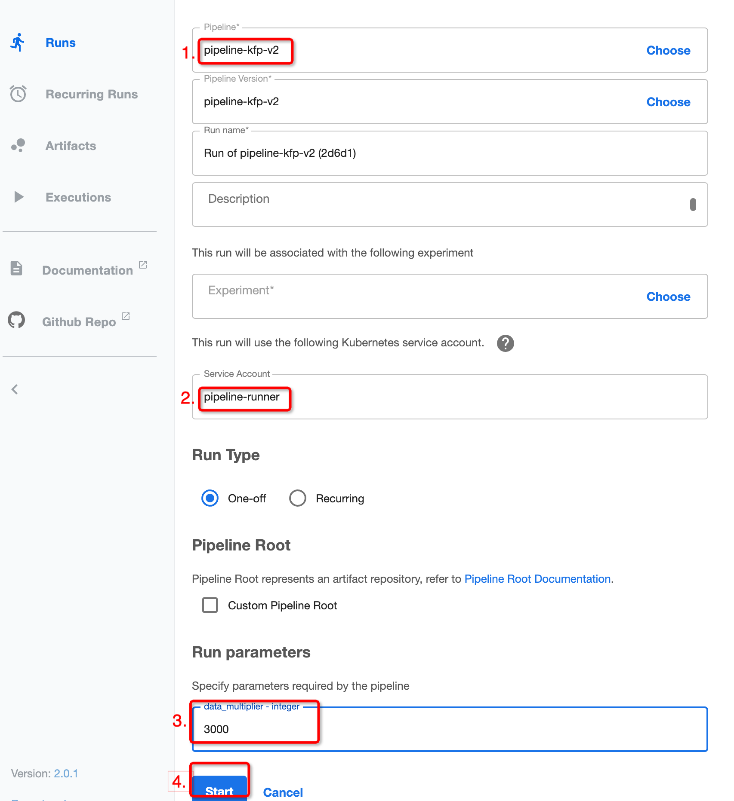

Efficient data sharing in Kubeflow with Vineyard CSI Driver
-----------------------------------------------------------

If you are using `Kubeflow Pipeline`_ or `Argo Workflow`_ to manage your machine learning workflow, 
you may find that the data saving/loading to the volumes is slow.
To speed up the data saving/loading within these volumes, we design the Vineyard CSI Driver to
map each vineyard object to a volume, and the data saving/loading is handled by vineyard.
Next, we will show you how to use the Vineyard CSI Driver to speed up a kubeflow pipeline.

Prerequisites
=============

- A kubernetes cluster with version >= 1.25.10. If you don't have one by hand, you can refer to the guide `Initialize Kubernetes Cluster`_ to create one.
- Install the `Vineyardctl`_ by following the official guide.
- Install the argo workflow cli >= 3.4.8.
- Install the kfp package <= 1.8.0 for kubeflow **v1** or >= 2.0.1 for kubeflow **v2**.

Deploy the Vineyard Cluster
===========================

.. code:: bash

    $ vineyardctl deploy vineyard-cluster --create-namespace

This command will create a vineyard cluster in the namespace `vineyard-system`.
You can check as follows:

.. code:: bash

    $ kubectl get pod -n vineyard-system
    NAME                                             READY   STATUS    RESTARTS   AGE
    vineyard-controller-manager-648fc9b7bf-zwnhd     2/2     Running   0          4d3h
    vineyardd-sample-79c8ffb879-6k8mk                1/1     Running   0          4d3h
    vineyardd-sample-79c8ffb879-f9kkr                1/1     Running   0          4d3h
    vineyardd-sample-79c8ffb879-lzgwz                1/1     Running   0          4d3h
    vineyardd-sample-etcd-0                          1/1     Running   0          4d3h

Deploy the Vineyard CSI Driver
==============================

Before deploying the Vineyard CSI Driver, you are supposed to check the vineyard 
deployment is ready as follows:

.. code:: bash

    $ kubectl get deployment -n vineyard-system        
    NAME                             READY   UP-TO-DATE   AVAILABLE   AGE
    vineyard-controller-manager      1/1     1            1           4d3h
    vineyardd-sample                 3/3     3            3           4d3h

Then deploy the vineyard csi driver which specifies the vineyard cluster to use:

.. tip::

    If you want to look into the debug logs of the vineyard csi driver, you can add a
    flag ``--verbose`` in the following command.

.. code:: bash

    $ vineyardctl deploy csidriver --clusters vineyard-system/vineyardd-sample

Then check the status of the Vineyard CSI Driver:

.. code:: bash

    $ kubectl get pod -n vineyard-system
    NAME                                             READY   STATUS    RESTARTS   AGE
    vineyard-controller-manager-648fc9b7bf-zwnhd     2/2     Running   0          4d3h
    vineyard-csi-sample-csi-driver-fb7cb5b5d-nlrxs   4/4     Running   0          4m23s
    vineyard-csi-sample-csi-nodes-69j77              3/3     Running   0          4m23s
    vineyard-csi-sample-csi-nodes-k85hb              3/3     Running   0          4m23s
    vineyard-csi-sample-csi-nodes-zhfz4              3/3     Running   0          4m23s
    vineyardd-sample-79c8ffb879-6k8mk                1/1     Running   0          4d3h
    vineyardd-sample-79c8ffb879-f9kkr                1/1     Running   0          4d3h
    vineyardd-sample-79c8ffb879-lzgwz                1/1     Running   0          4d3h
    vineyardd-sample-etcd-0                          1/1     Running   0          4d3h

Running the Kubeflow Pipeline example
=====================================

We provide two examples using different versions of Kubeflow Pipeline: **v1** and **v2**.
To use the Vineyard CSI Driver, we need to do two modifications:

1. Change APIs like **pd.read_pickle/write_pickle** to **vineyard.csi.write/read** in the source code.

2. Add the ``vineyard object`` VolumeOp to the pipeline's dependencies. The path in the API changed 
in the first step will be mapped to a volume. Notice, the volume used in any task needs to be 
explicitly mounted to the corresponding path in the source code, and the storageclass_name 
format of each VolumeOp is ``{vineyard-deployment-namespace}.{vineyard-deployment-name}.csi``.

There are two ways to add the ``vineyard object`` VolumeOp to the pipeline's dependencies:

- Each path in the source code is mapped to a volume, and each volume is mounted to the actual path 
  in the source code. The benefit is that the source path does not need to be modified.

- Create a volume for the paths with the same prefix in the source code. You can add the prefix ``/vineyard`` for 
  the paths in the source code, and mount a volume to the path ``/vineyard``. In this way, you can 
  only create one volume for multiple paths/vineyard objects.

You may get some insights from the modified pipeline ``pipeline-with-vineyard.py`` and ``pipeline-kfp-v2-with-vineyard``.

Preparations 
^^^^^^^^^^^^

Before running the kubflow examples, we need to do some common preparations, and then
you can choose to run **KFP V1** or **KFP V2** example.

1. First of all, we need to build the docker images for the pipeline:

.. code:: bash

    $ cd k8s/examples/vineyard-csidriver
    $ make docker-build

Or build the docker images with your docker registry:

.. code:: bash

    $ make docker-build REGISTRY=<your-docker-registry>

2. Check the images built successfully:

.. code:: bash

    $ docker images
    train-data               latest    5628953ffe08   14 seconds ago   1.47GB
    test-data                latest    94c8c75b960a   14 seconds ago   1.47GB
    prepare-data             latest    5aab1b120261   15 seconds ago   1.47GB
    preprocess-data          latest    5246d09e6f5e   15 seconds ago   1.47GB

3. Push the image to a docker registry that your kubernetes cluster can access.

.. code:: bash

    $ make push-images REGISTRY=<your-docker-registry>

4. Create the namespace for the pipeline:

.. code:: bash

    $ kubectl create namespace kubeflow

5. To simulate the data loading/saving of the actual pipeline, we use the nfs volume
to store the data. The nfs volume is mounted to the ``/mnt/data`` directory of the 
kind cluster. Then apply the data volume as follows:

.. tip::

    If you already have nfs volume that can be accessed by the kubernetes cluster,
    you can update the ``prepare-data.yaml`` to use your nfs volume.

.. code:: bash

    $ kubectl apply -f prepare-data.yaml

6. Deploy the rbac for the pipeline:

.. code:: bash

    $ kubectl apply -f rbac.yaml

7. **(important)** Download all need images to all kind workers:

.. code:: bash

    registry="ghcr.io/v6d-io/v6d/kubeflow-example"
    kubeflow_registry="gcr.io/ml-pipeline"
    worker=($(docker ps | grep kind-worker | awk -F ' ' '{print $1}'))
    for c in ${worker[@]}; do
        docker exec -it $c sh -c "
            crictl pull ${registry}/preprocess-data && \
            crictl pull ${registry}/train-data && \
            crictl pull ${registry}/test-data &&\
            # change the following image to compatible with the installed kubeflow version
            crictl pull ${kubeflow_registry}/argoexec:v3.3.10-license-compliance && \
            crictl pull ${kubeflow_registry}/kfp-driver@sha256:0ce9bf20ac9cbb21e84ff0762d5ae508d21e9c85fde2b14b51363bd1b8cd7528
            # change the following image to compatible with the installed argo workflow version
            crictl pull quay.io/argoproj/argoexec:v3.4.8
        "
    done

Running KFP V1 Example
^^^^^^^^^^^^^^^^^^^^^^

.. tip::

    If you want to run the **KFP V2** example, you can skip this section.

The original **KFP V1** code is shown in ``pipeline.py`` under the directory ``k8s/examples/vineyard-csidriver`` and the 
``pipeline-with-vineyard.py`` is modified to be compatible with the Vineyard CSI Driver. As we use the argo workflow to 
run the **KFP v1** pipeline, we need to install the argo workflow server as follows.

1. Install the argo server on Kubernetes:

.. code:: bash

    $ kubectl create namespace argo
    $ kubectl apply -n argo -f https://github.com/argoproj/argo-workflows/releases/download/v3.4.8/install.yaml

2. Check the status of the argo server:

.. code:: bash

    $ kubectl get pod -n argo           
    NAME                                  READY   STATUS    RESTARTS   AGE
    argo-server-7698c96655-ft6sj          1/1     Running   0          4d1h
    workflow-controller-b888f4458-sfrjd   1/1     Running   0          4d1h

3. Submit the kubeflow example without vineyard to the argo server:

.. code:: bash

    $ for data_multiplier in 4000 5000 6000; do \
        # clean the previous argo workflow
        argo delete --all -n kubeflow; \
        # submit the pipeline without vineyard
        argo submit --watch pipeline.yaml -n kubeflow  \
        -p data_multiplier=${data_multiplier} -p registry="ghcr.io/v6d-io/v6d/kubeflow-example"; \
        # sleep 60s to record the actual execution time
        sleep 60; \
    done

4. Clear the previous resources:

.. code:: bash

    $ argo delete --all -n kubeflow

5. Submit the kubeflow example with vineyard to the argo server:

.. code:: bash

    $ for data_multiplier in 3000 4000 5000; do \
        # clean the previous argo workflow
        argo delete --all -n kubeflow; \
        # submit the pipeline without vineyard
        argo submit --watch pipeline-with-vineyard.yaml -n kubeflow  \
        -p data_multiplier=${data_multiplier} -p registry="ghcr.io/v6d-io/v6d/kubeflow-example"; \
        # sleep 60s to record the actual execution time
        sleep 60; \
    done

Running KFP V2 Example
^^^^^^^^^^^^^^^^^^^^^^

.. tip::

    If you have installed the argo workflow server, you need to delete it first. As the KFP resources
    contain the argo workflow server, and the argo workflow server will conflict with the KFP resources.

The original **KFP V2** code is shown in ``pipeline-kfp-v2.py`` under the directory ``k8s/examples/vineyard-csidriver`` and the 
``pipeline-kfp-v2-with-vineyard.py`` is modified to be compatible with the Vineyard CSI Driver. As it can only be compiled to 
the IR YAML, which only recognized by the kubeflow server. Thus, we need to install the kubeflow server as follows.

1. Install a KFP standalone instance on Kubernetes:

.. code:: bash

    export PIPELINE_VERSION=2.0.1

    kubectl apply -k "github.com/kubeflow/pipelines/manifests/kustomize/cluster-scoped-resources?ref=$PIPELINE_VERSION"
    kubectl wait --for condition=established --timeout=60s crd/applications.app.k8s.io
    kubectl apply -k "github.com/kubeflow/pipelines/manifests/kustomize/env/dev?ref=$PIPELINE_VERSION"

2. Check the status of the KFP instance:

.. code:: bash

    $ kubectl get pod -n kubeflow

.. admonition:: Expected output
   :class: admonition-details

    .. code:: bash

        NAME                                                          READY   STATUS             RESTARTS         AGE
        cache-deployer-deployment-5c95fc7fdd-d65cf                    1/1     Running            0                49m
        cache-server-6c84679764-k8q6j                                 1/1     Running            0                49m
        controller-manager-86bf69dc54-2brxq                           1/1     Running            0                49m
        metadata-envoy-deployment-6448d544f5-z4sc8                    1/1     Running            0                49m
        metadata-grpc-deployment-784b8b5fb4-8mtm7                     1/1     Running            2 (49m ago)      49m
        metadata-writer-79c5499dd8-6jjmm                              1/1     Running            0                49m
        minio-65dff76b66-tdtx5                                        1/1     Running            0                49m
        ml-pipeline-6546dcc959-k8t84                                  1/1     Running            0                48m
        ml-pipeline-persistenceagent-79479cdb74-q6lq9                 1/1     Running            0                49m
        ml-pipeline-scheduledworkflow-5cbdc7d885-lx9r7                1/1     Running            0                49m
        ml-pipeline-ui-7c94d6f4b7-z2tvs                               1/1     Running            0                49m
        ml-pipeline-viewer-crd-685f449686-bz55g                       1/1     Running            0                49m
        ml-pipeline-visualizationserver-7c8f97864d-sp8p6              1/1     Running            0                49m
        mysql-c999c6c8-nwp9d                                          1/1     Running            0                49m
        proxy-agent-77d7b57c99-plrpb                                  0/1     CrashLoopBackOff   14 (2m17s ago)   49m
        workflow-controller-6c85bc4f95-dw889                          1/1     Running            0                49m

3. Delete the proxy deployment as it's not used in the example and will slow down the pipeline:

.. code:: bash

    $ kubectl delete deployment proxy-agent -n kubeflow

4. Open a terminal to portforward the KFP UI to your local machine:

.. code:: bash

    $ kubectl port-forward -n kubeflow svc/ml-pipeline-ui 8088:80

5. Upload the ``pipeline-kfp-v2.yaml`` and ``pipeline-kfp-v2-with-vineyard.yaml`` to the KFP instance:

.. tip::

    If you use the custom docker registry, you need to update the docker image 
    in the ``pipeline-kfp-v2.yaml`` and ``pipeline-kfp-v2-with-vineyard.yaml``.

.. figure:: ../../images/kubeflow_upload_pipeline.png
   :width: 75%
   :alt: Upload pipeline in the kubeflow Dashboard

   Upload pipeline in the kubeflow Dashboard

6. **(Important)** Clean the file system cache of the kubeflow server.

As the KFP V2 doesn't support to configure the ``SecurityContext`` of the container, which means
we can't run the command ``sync; echo 3 > /proc/sys/vm/drop_caches`` in the container to clean the 
file system cache. Thus before creating a new run, we need to clean the file system cache manually 
as follows:

.. code:: bash

    # clean all the file system cache and image cache of all kind workers
    $ worker=($(docker ps | grep kind-worker | awk -F ' ' '{print $1}')); \
        for c in ${worker[@]}; do docker exec --privileged -it $c \
        sh -c 'sync && echo 3 > /proc/sys/vm/drop_caches'; done;

If you use the actual kubernetes cluster, you can login to the kubernetes node and clean the file 
system cache manually.

7. Create the runs using the previously uploaded pipelines:

   Create runs in the kubeflow Dashboard

KFP V1 Result Analysis
^^^^^^^^^^^^^^^^^^^^^^

The data scale are 14000 Mi, 18000 Mi and 21000 Mi, which correspond to 
the 4000, 5000 and 6000 in the previous data_multiplier respectively, 
and the time of argo workflow execution of the pipeline is as follows:

Argo workflow duration
""""""""""""""""""""""

+------------+------------------+---------------+
| data scale | without vineyard | with vineyard |
+============+==================+===============+
| 14000 Mi   | 317s             | 270s          |
+------------+------------------+---------------+
| 18000 Mi   | 403s             | 331s          |
+------------+------------------+---------------+
| 21000 Mi   | 504s             | 389s          |
+------------+------------------+---------------+

Actually, the cost time of argo workflow is affected by lots of factors, 
such as the network, the cpu and memory of the cluster, the data volume, etc.
So the time of argo workflow execution of the pipeline is not stable. 
But we can still find that the time of argo workflow execution of the pipeline
with vineyard reduced by 15%~25%.

Also, we record the whole execution time via logs. The result is as follows:

Actual execution time
"""""""""""""""""""""

+------------+------------------+---------------+
| data scale | without vineyard | with vineyard |
+============+==================+===============+
| 14000 Mi   | 215.1s           | 140.3s        |
+------------+------------------+---------------+
| 18000 Mi   | 298.2s           | 198.1s        |
+------------+------------------+---------------+
| 21000 Mi   | 398.7s           | 257.5s        |
+------------+------------------+---------------+

According to the above results, we can find that the time of actual 
execution of the pipeline with vineyard reduced by 30%~40%. To be specific,
we record the write/read time of the following steps:

Writing time
""""""""""""

+------------+------------------+---------------+
| data scale | without vineyard | with vineyard |
+============+==================+===============+
| 14000 Mi   | 33.2s            | 8.8s          |
+------------+------------------+---------------+
| 18000 Mi   | 40.8s            | 11.6s         |
+------------+------------------+---------------+
| 21000 Mi   | 48.6s            | 13.9s         |
+------------+------------------+---------------+

From the above results, we can find that the writing time the pipeline 
with vineyard reduced by 70%~75%. The reason is that the data is stored 
in the vineyard cluster, so it's actually a memory copy operation, which 
is faster than the write operation of the nfs volume.

Reading time
""""""""""""

We delete the time of init data loading, and the results are as follows:

+------------+------------------+---------------+
| data scale | without vineyard | with vineyard |
+============+==================+===============+
| 14000 Mi   | 56.6s            | 0.02s         |
+------------+------------------+---------------+
| 18000 Mi   | 76.3s            | 0.02s         |
+------------+------------------+---------------+
| 21000 Mi   | 93.7s            | 0.02s         |
+------------+------------------+---------------+

Based on the above results, we can find that the read time of vineyard is
nearly a constant, which is not affected by the data scale.
The reason is that the data is stored in the shared memory of vineyard cluster, 
so it's actually a pointer copy operation.

As a result, we can find that with vineyard, the argo workflow 
duration of the pipeline is reduced by 15%~25% and the actual 
execution time of the pipeline is reduced by about 30%~40%.

KFP V2 Result Analysis
^^^^^^^^^^^^^^^^^^^^^^

Different with the previous KFP V1, the KFP V2 will compile the pipeline to the IR YAML,
and the IR YAML will be submitted to the kubeflow server. Before each component of the
pipeline is executed, the kubeflow server will create a preprocess container to parse
the IR YAML and generate the relevant kubernetes resources. That means the kubeflow server
will create more pods than the previous argo workflow, thereby slowing down the execution 
speed of the entire pipeline.

The execution time of the pipeline shown in the kubeflow dashboard is as follows:

Kubeflow dashboard duration
"""""""""""""""""""""""""""

+------------+------------------+---------------+
| data scale | without vineyard | with vineyard |
+============+==================+===============+
| 14000 Mi   | 276s             | 229s          |
+------------+------------------+---------------+
| 18000 Mi   | 365s             | 291s          |
+------------+------------------+---------------+
| 21000 Mi   | 440s             | 352s          |
+------------+------------------+---------------+

Based on the above result, we can find that the execution time of kubeflow pipeline with vineyard
is reduced by 15%~20% on the dashboard. Compared to the kfp v1, the vineyard effect is slightly
reduced. The reason is that in the kfp v2, CreateVolume and DeleteVolume are regarded as two components,
and that means more worker pods will be created. The time to create these pods is the main factor 
that reduces vineyard efficiency. 

Actual execution time
"""""""""""""""""""""

+------------+------------------+---------------+
| data scale | without vineyard | with vineyard |
+============+==================+===============+
| 14000 Mi   | 213s             | 133.4s        |
+------------+------------------+---------------+
| 18000 Mi   | 302.7s           | 208.1s        |
+------------+------------------+---------------+
| 21000 Mi   | 377.6s           | 265.9s        |
+------------+------------------+---------------+

From the above results, we can find that the actual execution time of the pipeline with vineyard
is reduced by 30%~40%. To be specific, we record the write/read time of the following steps:

Writing time
""""""""""""

+------------+------------------+---------------+
| data scale | without vineyard | with vineyard |
+============+==================+===============+
| 14000 Mi   | 33.2s            | 8.1s          |
+------------+------------------+---------------+
| 18000 Mi   | 41s              | 10.8s         |
+------------+------------------+---------------+
| 21000 Mi   | 48.3s            | 13.7s         |
+------------+------------------+---------------+

Similarly, since writing to vineyard is just a memory copy operation, its execution time 
will be greatly reduced.

Reading time
""""""""""""

We delete the time of init data loading, and the results are as follows:

+------------+------------------+---------------+
| data scale | without vineyard | with vineyard |
+============+==================+===============+
| 8500 Mi    | 54.5s            | 0.04s         |
+------------+------------------+---------------+
| 12000 Mi   | 73.5s            | 0.02s         |
+------------+------------------+---------------+
| 15000 Mi   | 88.9s            | 0.02s         |
+------------+------------------+---------------+

As the result in kfp v1, reading the vineyard data only requires a 
single operation to get the memory pointer. So the reading time of
vineyard is almost 0.

In summary, regardless of whether you are using KFP V1 or KFP V2, and whether the backend 
is Argo server or Kubeflow manifests, integrating Vineyard can effectively optimize the data 
sharing among Kubeflow components. This optimization, in turn, leads to a significant reduction 
in the overall execution time of the Kubeflow pipeline.

Clean up
========

Delete the rbac for the kubeflow example:

.. code:: bash

    $ kubectl delete -f rbac.yaml

Delete all argo workflow

.. code:: bash

    $ argo delete --all

Delete the argo server:

.. code:: bash

    $ kubectl delete ns argo

Delete the vineyard cluster:

.. code:: bash

    $ vineyardctl delete vineyard-cluster

Delete the data volume:

.. code:: bash

    $ kubectl delete -f prepare-data.yaml

Delete the kubeflow namespace:

.. code:: bash

    $ kubectl delete ns kubeflow

.. _Kubeflow Pipeline: https://github.com/kubeflow/kubeflow
.. _Argo Workflow: https://github.com/argoproj/argo-workflows
.. _Initialize Kubernetes Cluster: https://v6d.io/tutorials/kubernetes/using-vineyard-operator.html#step-0-optional-initialize-kubernetes-cluster
.. _Vineyardctl: https://v6d.io/notes/developers/build-from-source.html#install-vineyardctl
.. _Argo Workflow CLI: https://github.com/argoproj/argo-workflows/releases/